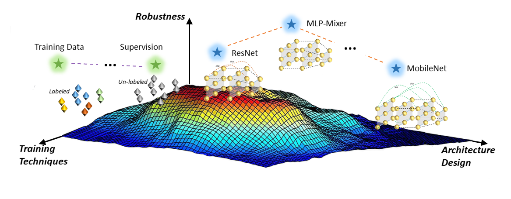

# RobustART: Benchmarking Robustness on Architecture Design and Training Techniques

**Website**: [https://robust.art](https://robust.art)

**Paper:** [https://openreview.net/forum?id=wu1qmnC32fB](https://openreview.net/forum?id=wu1qmnC32fB)

**Document**: [https://robust.art/api](https://robust.art/api)

**Leaderboard**: [http://robust.art/results](http://robust.art/results)

<p align="center">


# Abstract
Deep neural networks (DNNs) are vulnerable to adversarial noises, which motivates the benchmark of model robustness. 
Existing benchmarks mainly focus on evaluating the defenses, but there are no comprehensive studies on how architecture
design and general training techniques affect robustness. Comprehensively benchmarking their relationships will be 
highly beneficial for better understanding and developing robust DNNs. Therefore, we propose RobustART, the first comprehensive Robustness investigation benchmark on ImageNet (including open-source toolkit, pre-trained model zoo, datasets, and analyses) regarding ARchitecture
design (44 human-designed off-the-shelf architectures and 1200+ networks from
neural architecture search) and Training techniques (10+ general techniques, e.g.,
data augmentation) towards diverse noises (adversarial, natural, and system noises).
Extensive experiments revealed and substantiated several insights for the first time,
for example: (1) adversarial training largely improves the clean accuracy and
all types of robustness for Transformers and MLP-Mixers; (2) with comparable
sizes, CNNs > Transformers > MLP-Mixers on robustness against natural and
system noises; Transformers > MLP-Mixers > CNNs on adversarial robustness; 
for some light-weight architectures (e.g., EfficientNet, MobileNetV2, and Mo-
 bileNetV3), increasing model sizes or using extra training data reduces robustness.
 Our benchmark http://robust.art/: (1) presents an open-source platform for
 conducting comprehensive evaluation on different robustness types; (2) provides a
 variety of pre-trained models that can be utilized for downstream applications; (3)
 proposes a new perspective to better understand the mechanism of DNNs towards
 designing robust architectures, backed up by comprehensive analysis. We will
 continuously contribute to build this open eco-system for the community.

# Installation
You use conda to create a virtual environment to run this project.

```bash
git clone --recurse-submodules https://github.com/DIG-Beihang/RobustART.git
cd robustART
conda create --name RobustART
conda activate RobustART
pip install -r requirements.txt
```

Quick Start
=====================================

Common Setting
--------------
If you want to use this project to train or evaluate model(s), you can choose to create a work directory for saving config, checkpoints, scripts etc.

We have put some example for trainging or evlaluate. You can use it as follows


	cd exprs/exp/imagenet-a_o-loop
	bash run.sh


Add Noise
---------
You can use the AddNoise's add_noise function to add multiple noise for one image or a batch of images
The supported noise list is: ['imagenet-s', 'imagenet-c', 'pgd_linf', 'pgd_l2', 'fgsm', 'autoattack_linf', 'mim_linf', 'pgd_l1']

Example of adding ImageNet-C noise for image


	from RobustART.noise import AddNoise
	NoiseClass = AddNoise(noise_type='imagenet-c')
	# set the config of one kind of noise
	NoiseClass.setconfig(corruption_name='gaussian_noise')
	image_addnoise = NoiseClass.add_noise(image='test_input.jpeg')

Training Pipeline
-----------------
We provided cls_solver solver to train a model with a specific config

Example of using base config to train a resnet50

	cd exprs/robust_baseline_exp/resnet/resnet50
	#Change the python path to the root path
	PYTHONPATH=$PYTHONPATH:../../../../
	srun -n8 --gpu "python -u -m RobustART.training.cls_solver --config config.yaml"


Evaluation Pipeline
-------------------
We evaluate model(s) of different dataset, we provides several solver to evaluate the model on one or some specific dataset(s)

Example of evaluation on ImageNet-A and ImageNet-O dataset


	cd exprs/exp/imagenet-a_0-loop
	#Change the python path to the root path
	PYTHONPATH=$PYTHONPATH:../../../
	srun -n8 --gpu "python -u -m RobustART.training.cls_solver --config config.yaml"


Metrics
-------
We provided metrics APIs, so that you can use these APIs to evaluate results for ImageNet-A,O,P,C,S and Adv noise.


	from RobustART.metrics import ImageNetAEvaluator
	metric = ImageNetAEvaluator()
	metric.eval(res_file)

     
# Citation
```
@article{tang2021robustart,
title={RobustART: Benchmarking Robustness on Architecture Design and Training Techniques},
author={Shiyu Tang and Ruihao Gong and Yan Wang and Aishan Liu and Jiakai Wang and Xinyun Chen and Fengwei Yu and Xianglong Liu and Dawn Song and Alan Yuille and Philip H.S. Torr and Dacheng Tao},
journal={https://openreview.net/forum?id=wu1qmnC32fB},
year={2021}}
```
